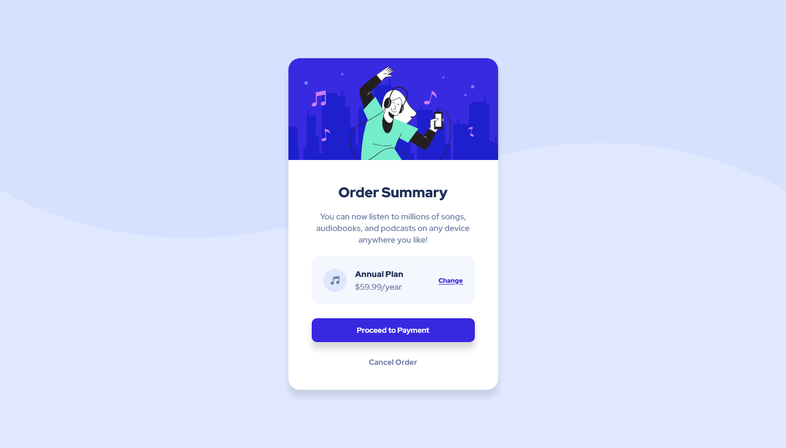

# Frontend Mentor - Order summary card solution

This is a solution to the [Order summary card challenge on Frontend Mentor](https://www.frontendmentor.io/challenges/order-summary-component-QlPmajDUj). Frontend Mentor challenges help you improve your coding skills by building realistic projects.

## Table of contents

- [Overview](#overview)
  - [The challenge](#the-challenge)
  - [Screenshot](#screenshot)
  - [Links](#links)
- [My process](#my-process)
  - [Built with](#built-with)
- [Author](#author)

## Overview

### The challenge

Users should be able to:

- See hover states for interactive elements

### Screenshot

### Links

- Solution URL: [Solution](https://www.frontendmentor.io/challenges/order-summary-component-QlPmajDUj/hub)
- Live Site URL: [Live Site](https://marvelous-phoenix-33b0cf.netlify.app/)

## My process

### Built with

- Semantic HTML5 markup
- CSS custom properties
- Flexbox
- CSS Variables
- Mobile-first workflow
- [React](https://reactjs.org/) - JS library
- Vite

## Author

- Website - [Pedro Calixto](https://wondrous-chaja-b0f2e7.netlify.app/)
- Frontend Mentor - [@DantDev](https://www.frontendmentor.io/profile/DantDev)
- Instagram - [@p3drr0](https://www.instagram.com/p3drr0)
